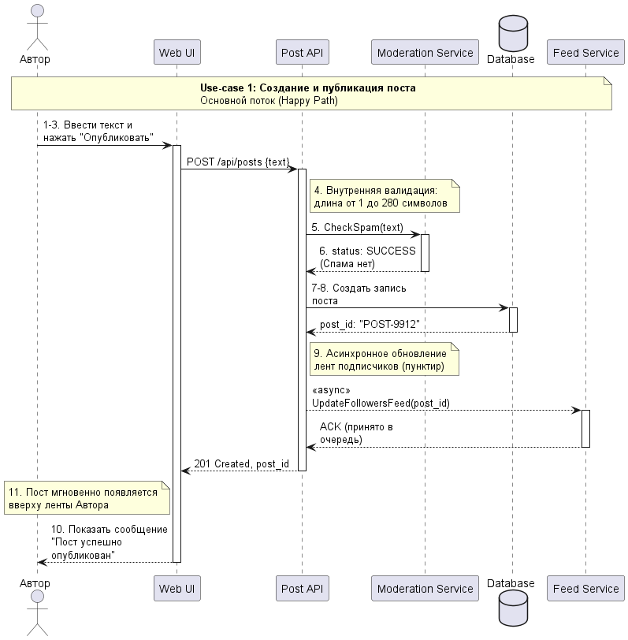
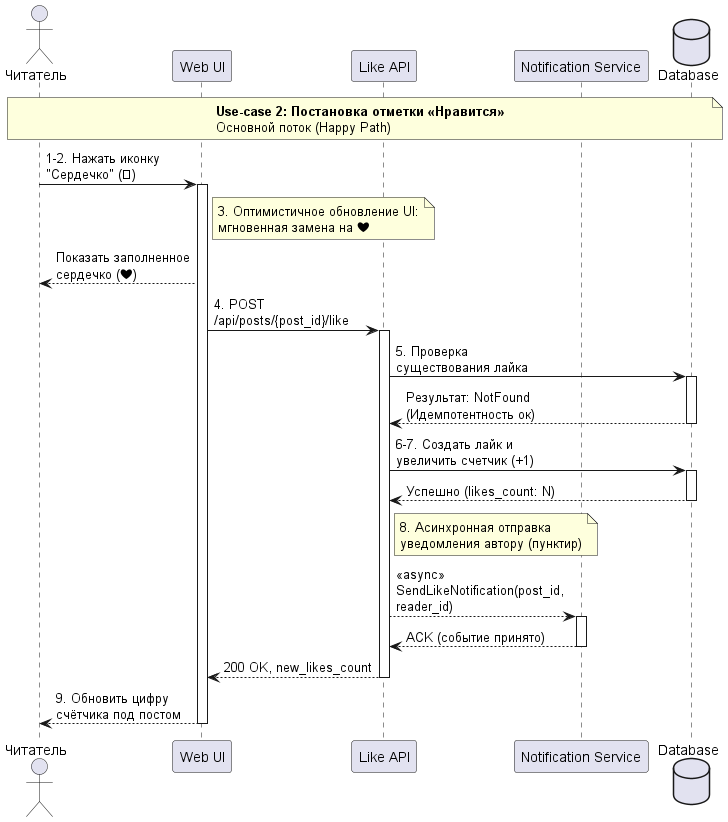
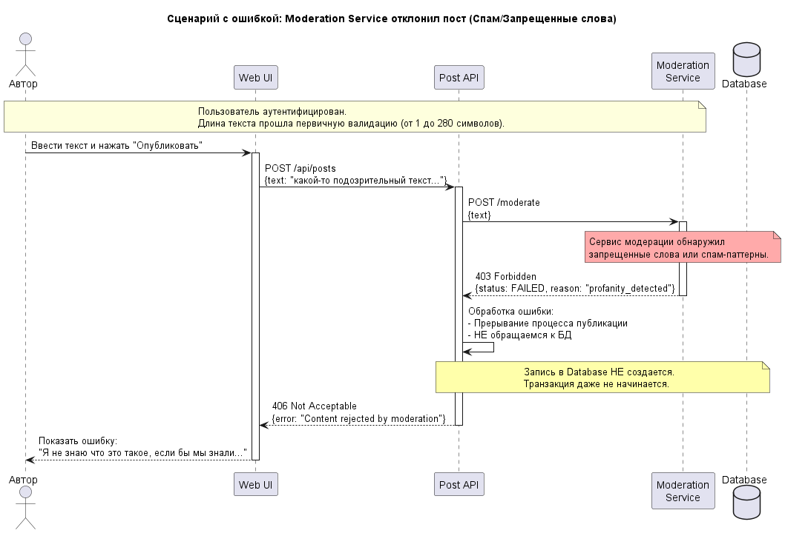

<p align="center">Министерство образования Республики Беларусь</p>
<p align="center">Учреждение образования</p>
<p align="center">"Брестский Государственный технический университет"</p>
<p align="center">Кафедра ИИТ</p>
<br><br><br><br><br><br>
<p align="center"><strong>Лабораторная работа №1</strong></p>
<p align="center"><strong>По дисциплине:</strong> "Проектирование интернет-систем"</p>
<p align="center"><strong>Тема:</strong> "Сценарий транзакции: моделирование use-case и границ ответственности"</p>
<br><br><br><br><br><br>
<p align="right"><strong>Выполнил:</strong></p>
<p align="right">Студент 3 курса</p>
<p align="right">Группы ПО-12</p>
<p align="right">Фолитарик Я.Л.</p>
<p align="right"><strong>Проверил:</strong></p>
<p align="right">Несюк А.Н.</p>
<br><br><br><br><br>
<p align="center"><strong>Брест 2026</strong></p>

---

## Цель работы

Научиться анализировать бизнес-процессы интернет-системы, выявлять границы ответственности компонентов и моделировать транзакционные сценарии с учётом возможных сбоев.

---

## Вариант № 20 - Микро-твиттер «Мысли вслух» 🐦

**Питч:** Коротко, но метко.

**Ядро домена:** Посты, Подписки, Лента, Лайки, Ответы, Модерация. Задание

---

## Ход выполнения работы

### 1. Структура проекта

```
lab-01/
├── README.md               # Основной отчёт (этот документ)
├── use-case.md             # Текстовое описание use-case
├── diagrams/
│   ├── sequence-happy.puml # PlantUML для успешного сценария
│   ├── sequence-happy.png  # Экспорт диаграммы
│   ├── sequence-error-payment.puml
│   └── sequence-error-payment.png
├── scenarios.feature       # Gherkin-сценарии
└── analysis.md             # Анализ границ ответственности
```

---

### 2. Use-case 

👉 **Ссылка на файл:** [use-case.md](use-case.md)

# Use-case: Создание и публикация поста

**Основной сценарий:** _Публикация нового поста_

**Первичный актор:** _Автор (Пользователь)_

**Цель:** _Опубликовать короткое текстовое сообщение так, чтобы оно сохранилось в профиле и ушло в ленты новостей подписчиков._

**Краткое описание основного потока:**
1. Автор открывает форму создания нового поста.
2. Автор вводит текст поста.
3. Автор нажимает кнопку «Опубликовать».
4. Система проверяет валидность данных (длина текста от 1 до 280 символов).
5. Система отправляет текст в Moderation Service для проверки на спам.
6. Moderation Service возвращает статус успеха.
7. Система создаёт запись поста в Database (генерирует уникальный ID, сохраняет пост).
8. Система обновляет ленту подписчиков.
9. Автор видит всплывающее сообщение «Пост успешно опубликован».
10. Пост мгновенно появляется вверху ленты Автора.

**Альтернативные потоки:**
- _Автор передумал публиковать (Черновик)_
- _Превышен лимит символов_

**Исключительные ситуации:**
- _Модерация отклонила пост_
- _База данных недоступна_


# Use-case: Постановка отметки «Нравится» (Лайк)

👉 **Ссылка на файл:** [use-case-like.md](use-case-like.md)

**Основной сценарий:** _Постановка лайка_

**Первичный актор:** _Читатель (Подписчик / Случайный пользователь)_

**Цель:** _Поставить отметку «Нравится» на понравившемся посте, чтобы автор получил обратную связь._

**Краткое описание основного потока:**
1. Пользователь находит пост в ленте и нажимает иконку «Сердечко» (🤍).
2. Система мгновенно меняет иконку на заполненное сердечко (❤️) на стороне клиента.
3. Система отправляет запрос на сервер для регистрации лайка.
4. Система проверяет, не ставил ли пользователь лайк ранее (идемпотентность).
5. Система создаёт запись в БД о новом лайке и увеличивает счётчик поста.
6. Notification Service отправляет уведомление автору.
7. Пользователь видит обновлённый счётчик лайков под постом.

**Альтернативные потоки:**
- _Передумал (Отмена лайка)_

**Исключительные ситуации:**
- _Попытка двойного лайка_
- _База данных недоступна_

---

### 3. Диаграммы последовательности (Sequence Diagrams)

#### 3.1. Happy Path (успешный сценарий) 

👉 **PlantUML исходник:** [sequence-happy.puml](diagrams/sequence-happy.puml)




👉 **PlantUML исходник:** [sequence-happy-like.puml](diagrams/sequence-happy-like.puml)



...

#### 3.2. Error Case (сценарий с ошибкой)

👉 **PlantUML исходник:** [sequence-error-notification.puml](diagrams/sequence-error-notification.puml)




### 4. Gherkin-сценарии

👉 **Ссылка на файл:** [scenarios.feature](scenarios.feature)

---

## 5. Анализ границ ответственности

### 5.1. Транзакционные границы

| Операция | Синхронная/Асинхронная | Откат при ошибке | Retry-стратегия | Идемпотентность |
|----------|------------------------|------------------|-----------------|-----------------|
| Валидация длины текста | Синхронная | Нет | N/A | Да |
| Вызов Moderation Service | Синхронная | Да (ROLLBACK) | 3 попытки (200ms, 500ms, 1s) | Да (ключ по тексту+автор) |
| Создание записи поста в БД | Синхронная | Да (ROLLBACK) | Нет (контролируется БД) | Да (idempotency_key) |
| Увеличение счётчика постов автора | Синхронная | Да (в транзакции) | Нет | Оптимистичная блокировка (version) |
| Генерация post_id | Синхронная | Нет | N/A | Да (UUID) |
| Публикация события PostCreated (outbox) | Синхронная | Да (часть транзакции) | Нет | Да (уникальный event_id) |
| Обновление лент подписчиков | Асинхронная | Нет | 5 попыток (exponential backoff) | Дедупликация по post_id+subscriber_id |
| Отправка push-уведомлений | Асинхронная | Нет | 5 попыток | Дедупликация |
| Индексация для поиска | Асинхронная | Нет | 3 попытки | Да |

### 5.2. Обработка исключительных ситуаций

**Реализовано стратегий обработки:** 4

**Примеры:**

#### Исключительная ситуация 1: Moderation Service недоступен
- **Условие возникновения:** Сервис модерации не отвечает (таймаут > 3 с, 5xx ошибки).
- **Обнаружение:** Таймаут или HTTP-код ошибки при вызове.
- **Реакция:** Выполняются повторные попытки (до 3 раз). Если все неудачны, транзакция не выполняется.
- **Компенсация:** Не требуется, так как транзакция не начата.
- **Уведомление пользователя:** «Сервис модерации временно недоступен. Попробуйте позже».

#### Исключительная ситуация 2: База данных недоступна
- **Условие возникновения:** PostgreSQL не отвечает (connection refused, timeout).
- **Обнаружение:** Ошибка при попытке выполнить SQL-запрос.
- **Реакция:** Транзакция откатывается. На уровне приложения выполняется до 3 повторных попыток с задержкой.
- **Компенсация:** Нет (пост не сохранён).
- **Уведомление пользователя:** «Не удалось опубликовать пост. Попробуйте позже». Текст сохраняется локально в черновик.

#### Исключительная ситуация 3: Конкурентное обновление счётчика постов (одновременная публикация двух постов)
- **Условие возникновения:** Два запроса одновременно пытаются увеличить posts_count у одного автора.
- **Обнаружение:** Оптимистичная блокировка (версия не совпала).
- **Реакция:** Транзакция откатывается, клиенту возвращается ошибка с предложением повторить.
- **Компенсация:** Автоматический повтор запроса на клиенте (с сохранением текста).
- **Уведомление пользователя:** Кратковременное сообщение «Повторная попытка...».

#### Исключительная ситуация 4: Попытка двойного лайка
- **Условие возникновения:** Пользователь нажимает лайк второй раз на том же посте.
- **Обнаружение:** Проверка существующей записи лайка перед вставкой.
- **Реакция:** Запрос игнорируется (идемпотентность), счётчик не изменяется.
- **Компенсация:** Не требуется.
- **Уведомление пользователя:** Интерфейс уже показывает заполненное сердечко, дополнительных сообщений нет.

---

## Таблица критериев оценки

| Критерий | Баллы | Выполнено |
|----------|-------|-----------|
| Use-case описание (полнота: акторы, предусловия, основной поток, альтернативы, исключения) | 15 | ❌ / ✅ |
| Sequence diagram (happy path) - корректность нотации UML, включение всех ключевых компонентов | 20 | ❌ / ✅ |
| Sequence diagram (error case) - моделирование хотя бы одной исключительной ситуации | 15 | ❌ / ✅ |
| Gherkin-сценарии - минимум 4 сценария (1 успешный + 3 ошибочных) | 20 | ❌ / ✅ |
| Анализ границ ответственности - таблица транзакционных границ, обоснование выбора синхронных/асинхронных операций | 15 | ❌ / ✅ |
| Обработка исключений - описание стратегий retry, компенсации, уведомлений | 10 | ❌ / ✅ |
| Качество документации - оформление, читаемость, грамотность | 5 | ❌ / ✅ |
| **ИТОГО** | **100** | |

---

## Контрольные вопросы

**Подготовка к защите:**

1. **Что такое транзакционная граница? Где она проходит в вашем сценарии?**  
   Транзакционная граница — это набор операций, которые выполняются атомарно: либо все успешно, либо ни одна. В сценарии публикации поста граница проходит от момента нажатия кнопки «Опубликовать» до коммита в БД. В эту границу входят: валидация текста, вызов сервиса модерации, создание записи поста, увеличение счётчика постов автора и публикация события через outbox. Всё, что происходит после коммита (обновление лент, уведомления), находится за границей и выполняется асинхронно.

2. **Почему операция X выбрана синхронной, а Y — асинхронной?**  
   - **Синхронные:** вызов Moderation Service, потому что от его результата зависит допустимость публикации (безопасность); запись в БД и обновление счётчика, так как это ядро операции и должно быть выполнено немедленно.  
   - **Асинхронные:** обновление лент подписчиков и отправка уведомлений, потому что они не влияют на факт публикации и допустима задержка (eventual consistency). Это снижает нагрузку на основной поток и повышает отзывчивость системы.

3. **Как обеспечить идемпотентность при повторных запросах?**  
   Используется механизм `idempotency_key`. Клиент генерирует уникальный ключ (например, UUID) и передаёт его в запросе. На сервере перед выполнением операции проверяется таблица `idempotent_requests`: если ключ уже есть, возвращается ранее сохранённый ответ, иначе операция выполняется, результат сохраняется в таблице. Ключи хранятся ограниченное время (например, 24 часа). Это предотвращает создание дублей при повторных отправках.

4. **Что произойдёт, если внешний сервис вернёт ошибку после частичного выполнения операции?**  
   В нашем сценарии все ключевые операции (модерация, запись в БД) выполняются в рамках одной транзакции. Если внешний сервис (Moderation Service) возвращает ошибку до коммита, транзакция откатывается, и система не сохраняет пост. Если ошибка происходит после коммита (например, при отправке события в очередь), используется transactional outbox: событие сохраняется в той же транзакции БД, и фоновый процесс гарантированно доставляет его, даже если временно сервис недоступен.

5. **Как система обнаружит, что внешний сервис недоступен?**  
   Система устанавливает таймаут на HTTP-вызов (например, 3 секунды для Moderation Service). Если по истечении времени ответ не получен или получен код ошибки 5xx (Service Unavailable, Bad Gateway и т.п.), генерируется исключение. Дополнительно могут использоваться health checks и circuit breaker для предотвращения каскадных сбоев.

6. **Какие данные нужно логировать для диагностики сбоев?**  
   Логировать необходимо:  
   - timestamp события  
   - уникальный идентификатор запроса (correlation ID)  
   - `idempotency_key`  
   - действие (публикация, лайк)  
   - статус ответа (успех/ошибка)  
   - время выполнения операции  
   - ошибки (стектрейсы, сообщения об ошибках)  
   - состояние системы (размер очередей, метрики БД)  
   Для отладки важно сохранять входные параметры (текст поста без чувствительных данных).

---

## Ссылка на репозиторий

👉 **GitHub:** [https://github.com/FolitYan](https://github.com/FolitYan)

---

## Вывод

В ходе выполнения лабораторной работы был проанализирован бизнес-процесс публикации поста и постановки лайка в микро-твиттере «Мысли вслух». Разработаны use-case описания для основного сценария и альтернативных потоков. Построены sequence diagrams с использованием PlantUML для визуализации взаимодействия компонентов системы в успешных и ошибочных ситуациях. Созданы Gherkin-сценарии для автоматизированного тестирования ключевых функций. Определены транзакционные границы, выделены операции, выполняемые синхронно и асинхронно, с обоснованием. Описаны стратегии обработки исключительных ситуаций, включая retry, идемпотентность, оптимистичную блокировку и уведомления пользователя.

---

**Дата выполнения:** 20.03.2026

**Оценка:** _____________

**Подпись преподавателя:** _____________
