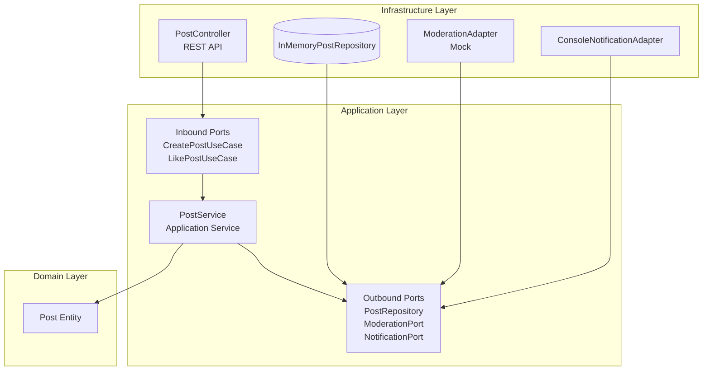

<p align="center">Министерство образования Республики Беларусь</p>
<p align="center">Учреждение образования</p>
<p align="center">"Брестский Государственный технический университет"</p>
<p align="center">Кафедра ИИТ</p>
<br><br><br><br><br><br>
<p align="center"><strong>Лабораторная работа №2</strong></p>
<p align="center"><strong>По дисциплине:</strong> "Проектирование интернет-систем"</p>
<p align="center"><strong>Тема:</strong> "Гексагональная архитектура: проектирование портов и адаптеров"</p>
<br><br><br><br><br><br>
<p align="right"><strong>Выполнил:</strong></p>
<p align="right">Студент 3 курса</p>
<p align="right">Группа ПО-12</p>
<p align="right">Фолитарик Я.Л.</p>
<p align="right"><strong>Проверил:</strong></p>
<p align="right">Несюк А.Н.</p>
<br><br><br><br><br>
<p align="center"><strong>Брест 2026</strong></p>

---

## Цель работы
Спроектировать архитектуру основного сервиса системы с использованием гексагональной (hexagonal) архитектуры: создать структуру проекта, определить порты (интерфейсы) и продемонстрировать изоляцию слоёв через минимальные примеры.

---
## Вариант №20 — Социальная сеть (Post Service)


**Питч:** Платформа для публикации коротких заметок и взаимодействия пользователей через лайки.

**Ядро домена:** Post (Пост), Author (Автор), Like (Лайк).

**Выбранный сервис:** Post Service (Сервис управления публикациями).

---

## Ход выполнения работы

### Часть 1. Архитектурная диаграмма

**Описание сервиса:** Post Service отвечает за создание публикаций, их валидацию, прохождение автоматической модерации и учет реакций пользователей (лайков).

**Диаграмма слоёв (Mermaid):**



---

### Часть 2. Структура проекта (скелет)

**Технология:** Java 17+, Maven/Gradle.

**Структура папок:**

```
post-service/
├── src/main/java/com/example/postservice/
│   ├── domain/                         # Domain Layer (Core)
│   │   ├── model/
│   │   │   └── Post.java               # Сущность
│   │   └── exception/
│   ├── application/                    # Application Layer (Use-cases)
│   │   ├── port/
│   │   │   ├── in/                     # Входящие порты
│   │   │   │   ├── CreatePostUseCase.java
│   │   │   │   └── LikePostUseCase.java
│   │   │   └── out/                    # Исходящие порты
│   │   │       ├── PostRepository.java
│   │   │       └── NotificationPort.java
│   │   └── service/
│   │       └── PostService.java        # Реализация (Оркестратор)
│   └── infrastructure/                 # Infrastructure Layer (Adapters)
│       ├── adapter/
│       │   ├── in/                     # Входящие адаптеры
│       │   │   └── PostController.java
│       │   └── out/                    # Исходящие адаптеры
│       │       ├── persistence/
│       │       └── notification/
│       └── config/
│           └── DependencyContainer.java # DI Конфигурация
```

---

### Часть 3. Domain Layer (Доменный слой)

#### Доменные сущности

**Entity 1: Post (Публикация)**

```java
package com.example.postservice.domain.model;

import java.time.LocalDateTime;

public class Post {
    private final String id;
    private final String authorId;
    private final String content;
    private int likesCount;

    public Post(String id, String authorId, String content) {
        this.id = id;
        this.authorId = authorId;
        this.content = content;
        this.likesCount = 0;
    }

    public boolean isValid() {
        return content != null && content.length() >= 1 && content.length() <= 280;
    }

    public void incrementLikes() {
        this.likesCount++;
    }

    public String getId() { return id; }
    public String getContent() { return content; }
}
```

#### Бизнес-правила
- Длина текста поста должна быть от 1 до 280 символов.
- Пост считается созданным только после прохождения модерации (реализовано в Service через Port).
- Счетчик лайков увеличивается только при наличии существующего поста.

---

### Часть 4. Application Layer (Прикладной слой)

#### Входящие порты (Inbound Ports)

**CreatePostUseCase:**

```java
public interface CreatePostUseCase {
    record CreatePostCommand(String authorId, String content) {}
    String createPost(CreatePostCommand command);
}
```

#### Исходящие порты (Outbound Ports)

**PostRepository:**

```java
public interface PostRepository {
    void save(Post post);
    Optional<Post> findById(String id);
}
```

#### Application Service

**PostService:**

```java
public class PostService implements CreatePostUseCase {
    private final PostRepository repository;
    private final ModerationPort moderationPort;

    public PostService(PostRepository repository, ModerationPort moderationPort) {
        this.repository = repository;
        this.moderationPort = moderationPort;
    }

    @Override
    public String createPost(CreatePostCommand command) {
        Post post = new Post(UUID.randomUUID().toString(), command.authorId(), command.content());
        if (!post.isValid()) throw new RuntimeException("Invalid content");
        
        if (moderationPort.isSafe(post.getContent())) {
            repository.save(post);
            return post.getId();
        }
        throw new RuntimeException("Moderation failed");
    }
}
```

---

### Часть 5. Infrastructure Layer (Инфраструктурный слой)

#### Входящий адаптер: REST API

**PostController (Заглушка):**

```java
public class PostController {
    private final CreatePostUseCase createPostUseCase;

    public PostController(CreatePostUseCase useCase) { this.createPostUseCase = useCase; }

    public String handleCreatePost(String authorId, String text) {
        return createPostUseCase.createPost(new CreatePostUseCase.CreatePostCommand(authorId, text));
    }
}
```

#### Исходящий адаптер: Repository

**InMemoryPostRepository:**

```java
public class InMemoryPostRepository implements PostRepository {
    private final Map<String, Post> store = new HashMap<>();

    @Override
    public void save(Post post) { store.put(post.getId(), post); }

    @Override
    public Optional<Post> findById(String id) { return Optional.ofNullable(store.get(id)); }
}
```

---

### Часть 6. Dependency Injection (Конфигурация)

```java
public class DependencyContainer {
    public PostService createPostService() {
        return new PostService(
            new InMemoryPostRepository(),
            content -> !content.contains("spam") // Simple Mock
        );
    }
}
```

---

### Часть 7. Тестирование

```java
class PostServiceTest {
    @Test
    void shouldCreatePostSuccessfully() {
        PostRepository repo = new InMemoryPostRepository();
        PostService service = new PostService(repo, text -> true);
        
        String id = service.createPost(new CreatePostCommand("user1", "Hello world"));
        
        assertNotNull(id);
        assertTrue(repo.findById(id).isPresent());
    }
}
```

---

## Выводы

**Что получилось хорошо:**  
Удалось полностью изолировать доменную модель `Post` от деталей реализации. Сервис `PostService` работает только с интерфейсами (портами), что позволяет легко заменить `InMemoryPostRepository` на реальную БД без изменения кода бизнес-логики.

**С какими трудностями столкнулись:**  
Основная сложность заключалась в правильном распределении классов по пакетам, чтобы случайно не нарушить правило зависимостей (Infrastructure не должен влиять на Domain).

**Что узнали нового:**  
Изучена концепция Ports & Adapters. Поняла, как инверсия зависимостей (DIP) помогает делать систему гибкой и пригодной для модульного тестирования.

---

**Дата сдачи:** 20.09.2025  
**Подпись студента:** _________ 